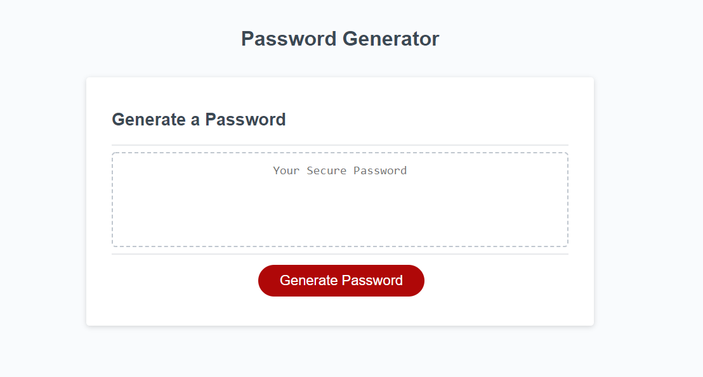

# JavaScript

## Description
- This was created to randomly generate a password based on the criteria you choose. 
- You have to provide the basic criteria or you can not generate the password. 
- It does randomly generate passwords if you meet the basic requirements. 

### Requirement Criteria for Password
- The password has to be between 8 and 128. 
- It must also contain 1 other special criteria:
    - Uppercase lettering, lowercase lettering, numbers, or special characters.

#### See below for Screenshot of page 

